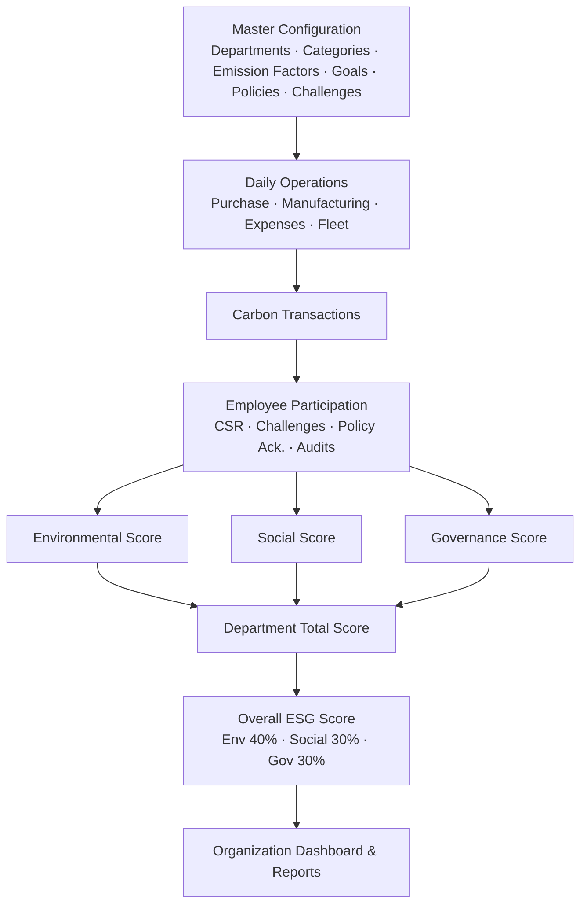

<div align="center">


<a href="#">
  
</a>

<br/>


</div>

<p align="center">
<strong>EcoSphere</strong> is a full-stack ESG (Environmental, Social, Governance) management platform that integrates sustainability tracking directly into day-to-day operations — replacing scattered spreadsheets with one live, gamified, role-based system.
</p>

---

## 📖 Table of Contents

- [Overview](#-overview)
- [The 7 Modules](#-the-7-modules)
- [Business Workflow](#-business-workflow)
- [Tech Stack](#-tech-stack)
- [Quick Start](#-quick-start)
- [Environment Variables](#-environment-variables)
- [Role & Privilege Matrix](#-role--privilege-matrix)
- [How ESG Scoring Works](#-how-esg-scoring-works)
- [Project Structure](#-project-structure)
- [Screenshots](#-screenshots)
- [License](#-license)

---

## 🌍 Overview

Most ERP systems track operational data but leave ESG reporting manual, disconnected, and impossible to monitor in real time. **EcoSphere** fixes that by unifying:

- 🍃 **Environmental** — carbon accounting, emission factors, sustainability goals
- 🤝 **Social** — CSR activities, employee participation, diversity, training
- 🛡️ **Governance** — policies, audits, compliance issue tracking
- 🏆 **Gamification** — challenges, XP, badges, rewards, leaderboards

...into a single dashboard, with a live weighted **Overall ESG Score** computed straight from real operational data.

---

## 🧩 The 7 Modules

<details open>
<summary><b>🔐 Phase 0 — Authentication, RBAC & Master Data</b></summary>
<br>

- Supabase Auth (JWT) integration with 3 roles: **Admin**, **ESG Manager**, **Employee**
- First registered user is automatically bootstrapped as Admin
- Department & Category CRUD with full hierarchy support
- Admin-only User Management & role promotion
</details>

<details>
<summary><b>🍃 Phase 1 — Environmental</b></summary>
<br>

- Emission Factor management (activity → CO₂e conversion)
- Carbon Transaction logging — manual entry or **auto-calculated** from linked ERP-style records (Purchase / Manufacturing / Expense / Fleet)
- Sustainability Goals with live progress tracking against actual emissions
- Interactive Environmental Dashboard (Recharts): emissions by department, monthly trend, goal progress
</details>

<details>
<summary><b>🤝 Phase 2 — Social</b></summary>
<br>

- CSR Activity scheduling & department alignment
- Employee participation with **Supabase Storage proof uploads** (image/PDF, 5MB cap, validated client-side)
- Manager approval workflow — configurable to require proof before approval
- Diversity & Inclusion metrics (gender ratio, age brackets) with charts
- Training completion tracking with Admin/Manager-gated status changes
</details>

<details>
<summary><b>🛡️ Phase 3 — Governance</b></summary>
<br>

- Versioned ESG Policies scoped to departments or company-wide
- Policy Acknowledgement tracking with reminder system
- Departmental Audit logging
- Compliance Issue tracking with mandatory Owner + Due Date
- **Overdue issue auto-flagging**, prominently surfaced on the Governance Dashboard
</details>

<details>
<summary><b>🏆 Phase 4 — Gamification</b></summary>
<br>

- Challenges with full lifecycle: Draft → Active → Under Review → Completed / Archived
- Challenge participation with proof submission & manager approval
- **Shared points balance** — CSR approvals and Challenge approvals both feed the same balance used for rewards
- Separate lifetime XP tracking so redeeming rewards never resets badge progress
- Auto-awarded Badges based on configurable unlock rules
- Redeemable Rewards catalog with live stock tracking
- Department-filterable Leaderboard
</details>

<details>
<summary><b>📊 Phase 5 — Scoring, Dashboard & Reports</b></summary>
<br>

- Per-department Environmental / Social / Governance scores computed from real underlying data (not static inputs)
- Configurable pillar weighting (default: Env 40% / Social 30% / Governance 30%)
- Organization-wide ESG Dashboard with live score gauge, department leaderboard, and historical trend
- 4 fixed reports + a **Custom Report Builder** with 6 filter types (Department, Date Range, Module, Employee, Challenge, ESG Category)
- Export to **PDF, Excel, and CSV**
</details>

<details>
<summary><b>🔔 Phase 6 — Notifications & Settings</b></summary>
<br>

- In-app notification system with unread badge counter and live polling
- Email delivery via Brevo SMTP (gracefully degrades to in-app-only if unconfigured)
- Per-event-type notification preferences (Admin-configurable)
- Consolidated ESG Configuration page: emission auto-calc, CSR proof requirement, badge auto-award, and pillar weights in one place
</details>

---

## 🔄 Business Workflow



---

## 🛠 Tech Stack

| Layer | Technology |
|---|---|
| **Frontend** | React 19 (Vite), Tailwind CSS v4, Lucide Icons, Recharts |
| **Backend** | Flask 3.1, SQLAlchemy ORM, PyJWT |
| **Database & Auth** | Supabase (PostgreSQL + Auth) |
| **File Storage** | Supabase Storage (CSR & Challenge proof uploads) |
| **Email** | Brevo SMTP (graceful fallback if unconfigured) |
| **Reports** | ReportLab (PDF), OpenPyXL (Excel), native CSV |

---

## ⚙️ Quick Start

### Prerequisites
- Python 3.10+
- Node.js 18+
- A free [Supabase](https://supabase.com) project

### 1. Clone & configure
```bash
git clone https://github.com/Hari-preetham-B/EcoSphere.git
cd EcoSphere
cp backend/.env.example backend/.env   # then fill in your real values
```

### 2. Backend
```bash
cd backend
python -m venv venv
# Windows:
.\venv\Scripts\activate
# macOS/Linux:
source venv/bin/activate

pip install -r requirements.txt
python app.py
```
> On first run, the backend auto-creates all tables and seeds realistic demo data (emission factors, mock ERP records, sample policies, challenges, badges, and rewards) so the app is immediately explorable.

### 3. Frontend
```bash
cd frontend
npm install
npm run dev
```
Open **http://localhost:5173** — register the first account to become Admin automatically.

---

## 🔑 Environment Variables

See `backend/.env.example` for the full list. At minimum you'll need:

| Variable | Purpose |
|---|---|
| `DATABASE_URL` | Supabase Postgres connection string |
| `SUPABASE_URL` | Your Supabase project URL |
| `SUPABASE_PUBLISHABLE_KEY` | Frontend-safe Supabase key |
| `SUPABASE_SECRET_KEY` | Backend-only Supabase key |
| `BREVO_SMTP_*`, `SENDER_EMAIL` | Optional — email notifications (in-app works without these) |

---

## 📋 Role & Privilege Matrix

| Module / Action | Admin | ESG Manager | Employee |
|---|:---:|:---:|:---:|
| User Management & Role Promotion | ✅ | ❌ | ❌ |
| Department & Category CRUD | ✅ | ❌ | ❌ |
| Emission Factors CRUD | ✅ | ✅ | ❌ |
| Log Carbon Transactions | ✅ | ✅ | ✅ |
| Sustainability Goals CRUD | ✅ | ✅ | ❌ |
| Schedule / Approve CSR Activities | ✅ | ✅ | ❌ |
| Register & Upload CSR Proof | ✅ | ✅ | ✅ |
| ESG Policies & Audits CRUD | ✅ | ✅ | ❌ |
| Acknowledge Policies | ✅ | ✅ | ✅ |
| Compliance Issue Management | ✅ | ✅ | ❌ |
| Create Challenges / Badges / Rewards | ✅ | ✅ | ❌ |
| Join Challenges & Redeem Rewards | ✅ | ✅ | ✅ |
| View Scoring Dashboard & Reports | ✅ | ✅ | 🔸 View-only |
| ESG Configuration & Notification Settings | ✅ | ❌ | ❌ |

---

## 🧮 How ESG Scoring Works

Each department gets three pillar scores (0–100), combined into a weighted Total Score:

- **Environmental** = 50% relative emissions benchmark (vs. company average) + 50% sustainability goal progress
- **Social** = 50% department CSR participation rate + 50% training completion rate
- **Governance** = 50% policy acknowledgement rate + 50% compliance issue resolution rate (with a scaled overdue-issue penalty)

```
Department Total = (0.40 × Environmental) + (0.30 × Social) + (0.30 × Governance)
Overall ESG Score = average(all Department Total Scores)
```

Pillar weights are configurable per organization under **Settings → ESG Configuration**.

---

## 📁 Project Structure

```
EcoSphere/
├── backend/
│   ├── app.py                 # Entry point, blueprint registration, seeding
│   ├── models.py               # All 24 SQLAlchemy models
│   ├── auth.py                 # JWT verification & RBAC decorators
│   └── routes/                 # One blueprint per module
└── frontend/
    └── src/
        ├── pages/               # Environmental / social / governance / gamification / scoring / notifications
        ├── components/layout/   # Sidebar, Navbar, Layout
        ├── context/AuthContext.jsx
        └── lib/api.js           # Shared authenticated fetch helper
```

---

## 🖼 Screenshots

<div align="center">
<i>Add screenshots or a short demo GIF here — the Organization Dashboard and Governance overdue-issue banner make strong first impressions.</i>
</div>

---

<div align="center">

## 📜 License

Licensed under the **MIT License**.


</div>
